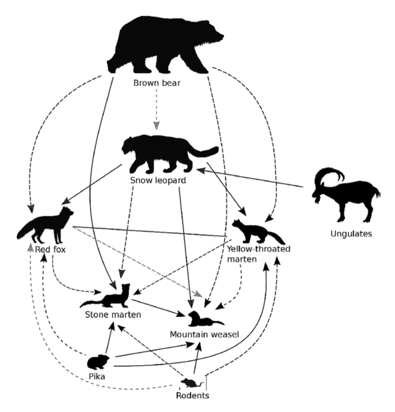

---
hide:
  - toc
---

# Projects

A selection of my ecological research projects. Click any card to see the full write-up.

**[Carnivore Spatio-temporal Interactions, Western Himalaya](carnivore-himalaya.md)**

Examined how prey availability and intraguild interactions structure a six-species carnivore 
assemblage across 26,000 km² of high-altitude Himachal Pradesh using camera traps and 
Bayesian multi-species occupancy models. Published in *Journal of Zoology* (2024).

`R` `Bayesian Occupancy Models` `Camera Traps` `Google Earth Engine`

[View Project →](carnivore-himalaya.md){ .md-button }

